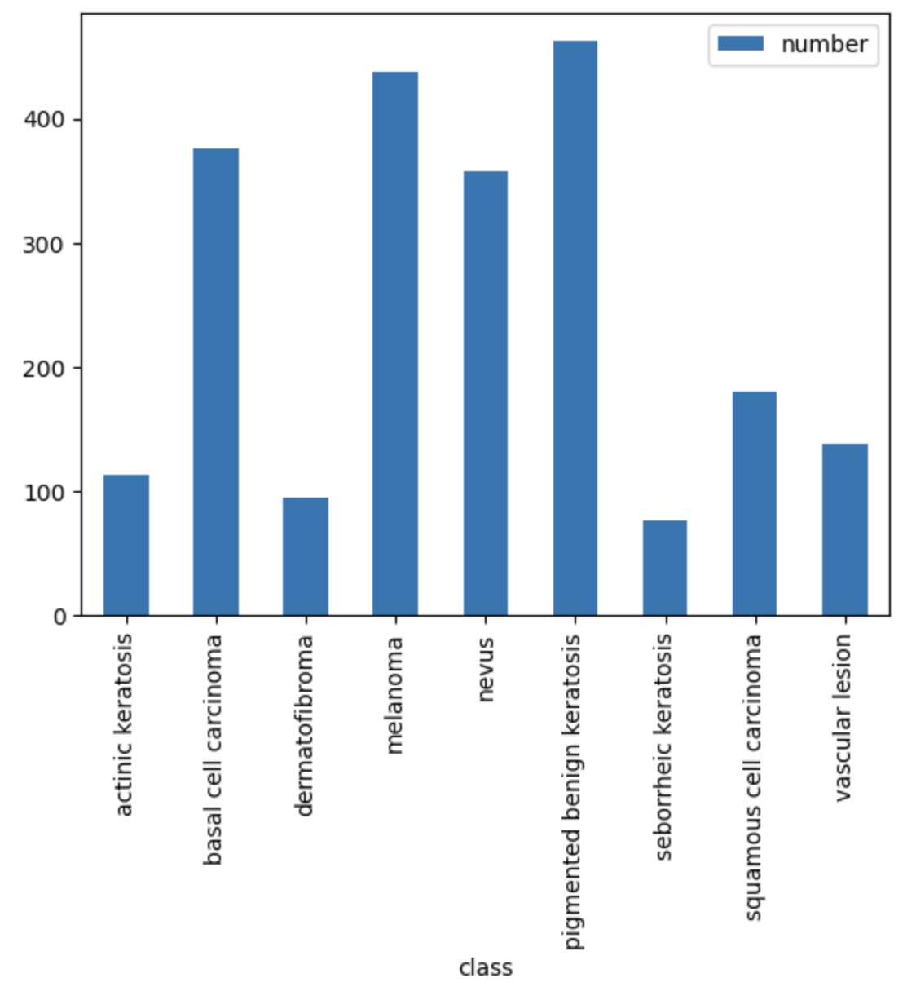
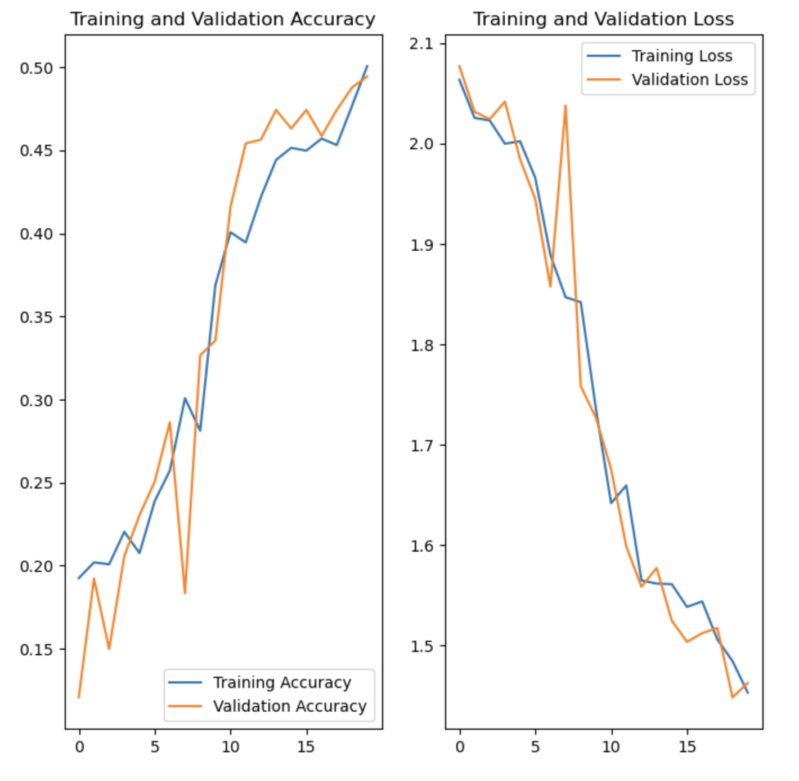
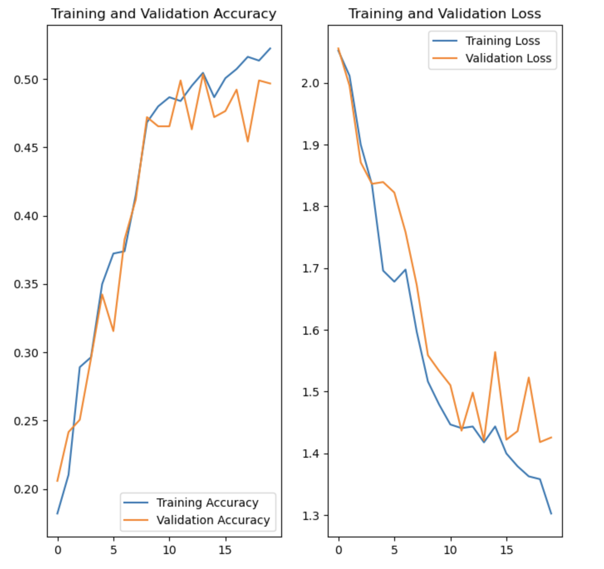
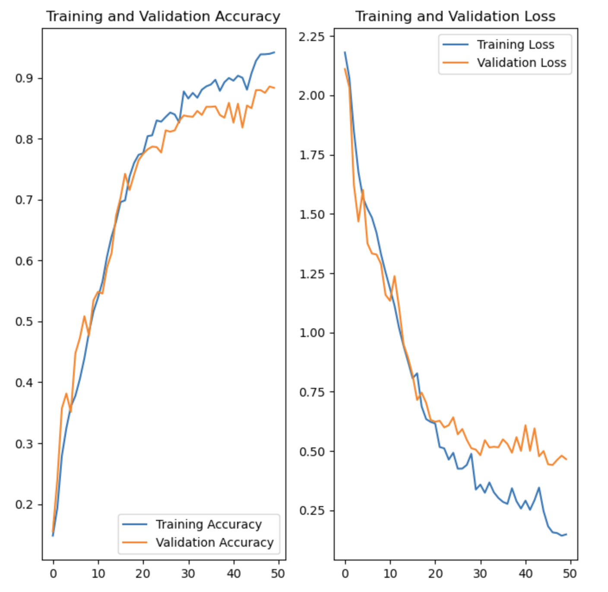

# Melanoma Detection using CNN
> This project is to build a CNN based model which can accurately detect melanoma. Melanoma is a type of cancer that can be deadly if not detected early. It accounts for 75% of skin cancer deaths. A solution which can evaluate images and alert the dermatologists about the presence of melanoma has the potential to reduce a lot of manual effort needed in diagnosis.
Currently this model, predicts with 88% accuracy.

## Table of Contents
* [General Info](#general-information)
* [Observations](#observations)
* [Conclusions](#conclusions)
* [Technologies](#technologies-used)

## General Information
### Algorithm used
Convolutional Neural Network

### About the dataset
There are total 2357 images which includes 2239 train images and 118 test images.

There are total 9 classes of data as below -

### Steps
- Data Loading
- Baseline Model Building
- Train and test the model
- Build an augmented model
- Train the augmented model and test the model
- Figur out the **Class Imbalance** with augmentor
- Build the final model
- Train the final model and test the model
- Verify the model on test data

## Observations
### Baseline model -

### Augmented model -

### Final model -

## Conclusions
- We see that loss decreases when the accuracy increases. The final model after augmentation has an accuracy of `88%` and a loss of `0.4`. The model is able to predict a test image accuractely. 
- Augmenting the data and countering class imbalance helped in improving the accuracy of the model.

## Technologies Used
- Python 3.0
- Tensorflow
- keras
- Augmentor
- Pandas
- Matplotlib
- Numpy
- Google colab (for initial building)

## Contact
Created by [@PrasunPK] - feel free to contact me!